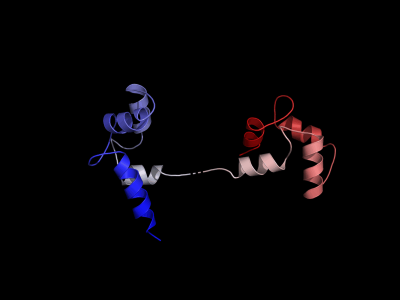
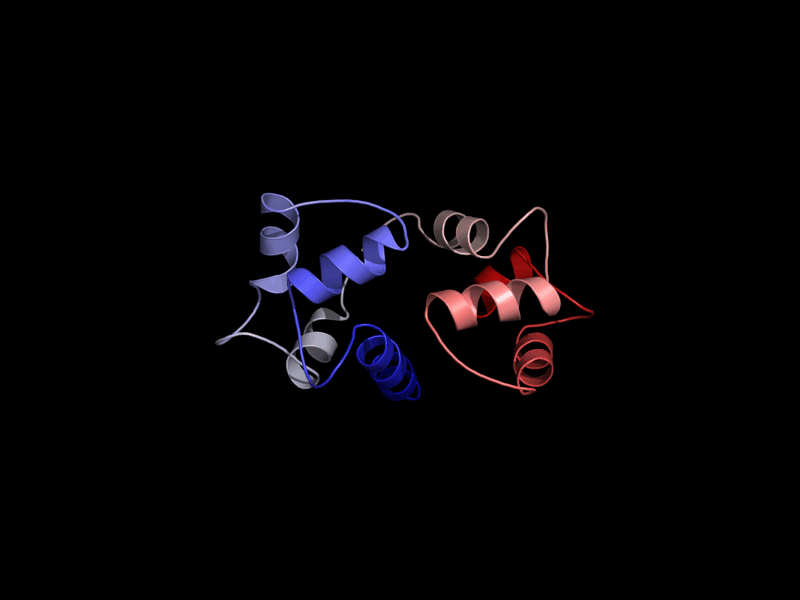

## Introducción y motivación

Las proteínas no son objetos rígidos. Para llevar a cabo su función biológica
suelen pasar por distintas conformaciones: dominios que se abren y se cierran,
hélices que se reorganizan al unir un ligando, lóbulos que se acercan al captar un
ion. Sin embargo, la cristalografía de rayos X y la crio-microscopía electrónica nos
ofrecen normalmente *fotografías* estáticas de esos estados, una por estructura
depositada en el Protein Data Bank (PDB).

La idea de esta práctica parte de una observación sencilla: si una misma proteína
ha sido cristalizada en varias condiciones (mutantes, distintos cofactores, formas
apo y holo…), cada una de esas estructuras captura un instante distinto de su
movimiento. Si las ordenamos de forma razonable y las mostramos en secuencia,
obtenemos una **animación** que, aunque sea una aproximación muy burda, permite
*intuir* el cambio conformacional que la proteína podría experimentar *in vivo*.

Con esa idea en mente he desarrollado **Protein Structure Animator**, una herramienta
que automatiza todo el proceso: desde la búsqueda de estructuras homólogas hasta la
generación del GIF animado final.

## Objetivos

Mis objetivos al abordar la práctica fueron:

1. Tomar como entrada una lista de códigos PDB **con su cadena** correspondientes a la
   misma proteína y producir una animación en la que cada estructura es un fotograma.
2. **Automatizar** la obtención de esa lista mediante las APIs públicas de BLAST y de
   RCSB, aplicando filtros de identidad de secuencia y de calidad.
3. Ordenar los fotogramas de manera que la transición entre estructuras consecutivas
   sea lo más continua posible.
4. Añadir una **interpolación** que suavice el salto cuando dos estructuras
   consecutivas son muy diferentes.
5. Envolver todo en una interfaz sencilla para no depender de la línea de comandos.

Los puntos 2 y 4 se correspondían con las mejoras opcionales que el enunciado
señalaba como valorables, y por eso decidí implementarlos desde el principio.

## Diseño general

Opté por separar el problema en tres etapas independientes, cada una en su propio
módulo, más una interfaz que las orquesta. Esta separación me facilitó mucho la
depuración, porque pude probar cada pieza por separado.

```{mermaid}
flowchart TD
    A["Entrada:<br/>secuencia FASTA o código PDB"] --> B["pdb_fetcher.py<br/>búsqueda + descarga"]
    B --> C["interpolator.py<br/>alineamiento + orden + interpolación"]
    C --> D["animator.py<br/>render + GIF"]
    D --> E["GIF animado"]
    F["app.py — interfaz Gradio"] -.orquesta.-> B
    F -.orquesta.-> C
    F -.orquesta.-> D
```

| Módulo | Responsabilidad | Tecnología principal |
|---|---|---|
| `src/pdb_fetcher.py` | Buscar homólogos y descargar los `.pdb` | Biopython (BLAST), RCSB Search API, requests |
| `src/interpolator.py` | Alinear, ordenar e interpolar las estructuras | PyMOL (modo headless) |
| `src/animator.py` | Renderizar fotogramas y montar el GIF | PyMOL + Pillow |
| `app.py` | Interfaz web y orquestación | Gradio |

: Organización del proyecto en módulos. {#tbl-modulos}

## Desarrollo

### Obtención automática de estructuras

Quería que el usuario pudiera partir de dos puntos distintos, así que implementé dos
vías de búsqueda en `pdb_fetcher.py`:

- **A partir de una secuencia (modo FASTA).** Lanzo un BLASTP contra la base de datos
  PDB con `Bio.Blast.NCBIWWW` y filtro los resultados por porcentaje de **identidad** y
  de **cobertura** de la secuencia consulta. De cada hit conservo el código y la cadena.

- **A partir de un código PDB conocido (modo RCSB).** Recupero la secuencia de la
  estructura de referencia y construyo una consulta para la **RCSB Search API v2** que
  combina un servicio de similitud de secuencia con un filtro de **resolución máxima**.
  La consulta tiene esta forma:

```python
query = {
    "query": {
        "type": "group",
        "logical_operator": "and",
        "nodes": [sequence_node, resolution_node],
    },
    "return_type": "polymer_instance",
    "request_options": {
        "paginate": {"start": 0, "rows": max_results},
        "sort":     [{"sort_by": "score", "direction": "desc"}],
    },
}
```

Un detalle que me costó descubrir (lo explico en @sec-retos) es el uso de
`return_type: "polymer_instance"`: gracias a él la API me devuelve **la cadena exacta**
que ha casado con la búsqueda, en lugar de tener que adivinarla.

Finalmente, `download_pdbs` descarga cada archivo desde `files.rcsb.org` y devuelve
parejas `(ruta, cadena)`, de modo que la información de qué cadena animar viaja junta
con el archivo a lo largo de todo el pipeline.

### Alineamiento, ordenación e interpolación

Este es el núcleo del proyecto y lo implementé sobre una sesión de **PyMOL sin
interfaz gráfica** (`pymol -cq`), que dejo abierta para que el módulo de animación
pueda reutilizarla sin reinicializar el programa. El proceso, en `interpolator.py`,
sigue cinco pasos:

1. **Carga y filtrado de cadena.** Cargo cada PDB y elimino todo lo que no pertenezca a
   la cadena solicitada, para animar únicamente la proteína de interés y descartar
   aguas, ligandos u otras cadenas del complejo.

2. **Alineamiento estructural.** Superpongo todas las estructuras sobre la primera
   (la de referencia) con `cmd.align`, guardando el RMSD de cada superposición.

3. **Ordenación por RMSD.** Ordeno las estructuras de menor a mayor RMSD respecto a la
   referencia. Así consigo que dos fotogramas consecutivos representen el **menor salto
   estructural posible**, que es lo que el enunciado llamaba un orden "adecuado".

4. **Reducción a átomos comunes.** Para poder interpolar necesito que todas las
   estructuras compartan exactamente los mismos átomos y en el mismo orden. Primero
   descarto las estructuras que apenas solapan con la referencia (fragmentos, numeración
   distinta o cadena equivocada) y después me quedo con los átomos `(residuo, nombre)`
   comunes a todas. El resultado es una correspondencia atómica **1:1** entre fotogramas.

5. **Interpolación lineal.** Entre cada par de estructuras consecutivas $A$ y $B$
   inserto un número configurable de fotogramas intermedios, calculados como una
   combinación lineal de sus coordenadas:

$$
P(t) = (1 - t)\,A + t\,B, \qquad t \in (0, 1)
$$

```python
for s in range(1, steps + 1):
    fraction     = float(s) / float(steps)
    interpolated = start * (1.0 - fraction) + end * fraction
    state        = state + 1
    cmd.create(_MORPH_OBJECT, template, 1, state)
    cmd.load_coords(interpolated, _MORPH_OBJECT, state)
```

De esta forma, dos estructuras muy diferentes quedan conectadas por una transición
suave en lugar de un cambio brusco de un fotograma al siguiente.

### Renderizado y montaje del GIF

En `animator.py` aplico un estilo visual de **cartoon** coloreado por índice de
residuo (un espectro azul → blanco → rojo) sobre fondo negro, que me parecía el más
claro para apreciar el movimiento. Después renderizo cada estado de la trayectoria a
un PNG con `cmd.png` y monto todos los PNG en un **GIF en bucle** con Pillow. Convierto cada fotograma a RGB antes del montaje porque,
si no, el primer fotograma parpadeaba en cada repetición por un problema de
transparencia.

### Interfaz de usuario

Para no obligar a nadie a tocar la línea de comandos, monté una interfaz web con
**Gradio**. Tiene dos pestañas de entrada (secuencia FASTA o código PDB), controles
deslizantes para todos los parámetros (identidad, cobertura, resolución, pasos de
interpolación y FPS) y un panel de resultados que muestra los códigos seleccionados,
el estado del pipeline y el GIF generado. Toda la lógica de orquestación está en la
función `run_pipeline`, que comunica los posibles errores como texto en la propia
interfaz en lugar de lanzar excepciones.

## Retos encontrados {#sec-retos}

La parte que más tiempo me llevó no fue escribir el código inicial, sino conseguir que
funcionara con casos reales. Destaco tres problemas concretos:

::: {.callout-important}
## `cmd.morph` no existe en PyMOL open-source
Mi primera versión usaba la orden `cmd.morph` de PyMOL para generar la trayectoria,
pero al ejecutarla con `pymol-open-source` el programa fallaba siempre. Tras leer la
traza del error entendí que esa función solo está disponible en la versión de pago
(*Incentive*). Decidí entonces **plantear con ayuda de la IA la interpolación lineal de coordenadas**
como alternativa que además encaja con la mejora opcional del enunciado; para
concretar la sintaxis exacta de la API de PyMOL en modo *headless* (`cmd.create`,
`cmd.load_coords`) me apoyé puntualmente en una herramienta de IA, ya que esa parte de
la API está muy poco documentada. El planteamiento y la revisión del código fueron míos.
:::

::: {.callout-important}
## La proteína no siempre está en la cadena A
Al probar con la calmodulina (`1CLL`) descubrí que muchas entradas son **complejos** en
los que mi proteína de interés no está en la cadena A, sino en la B, C, etc. (por
ejemplo, la calmodulina está en la cadena B de `1G4Y`). Como yo asumía siempre la
cadena A, estaba cargando proteínas equivocadas y la interpolación no encontraba átomos
en común. Una vez identificado el problema, confirmé con ayuda de IA que la API de RCSB
permite resolverlo con el tipo de retorno `polymer_instance`, que indica exactamente qué
cadena ha casado con la búsqueda. El diagnóstico (ver que estaba cargando la cadena
equivocada) fue lo que más me costó y lo hice a partir de los resultados.
:::

::: {.callout-important}
## Estructuras incompatibles que rompían la animación
Una búsqueda amplia puede devolver fragmentos o estructuras con una numeración de
residuos distinta. Bastaba con que una sola de ellas no encajara para que el conjunto
de átomos comunes quedara vacío y no se pudiera animar nada. Añadí un **filtro de
solapamiento mínimo** con la referencia que descarta esos casos anómalos antes de
interpolar.
:::

::: {.callout-important}
## Fallos intermitentes de la API de RCSB
Haciendo pruebas repetidas observé que, de vez en cuando, la API de búsqueda de RCSB
devuelve un error **HTTP 400** para una consulta que funciona perfectamente al repetirla
unos segundos después. Sin protección, el programa lo interpretaba como "no hay
homólogos" y la animación fallaba de forma aparentemente aleatoria —con la misma proteína
unas veces funcionaba y otras no—. Añadí **reintentos automáticos** con una breve espera
creciente en las tres llamadas de red (búsqueda, descarga de la secuencia y descarga de
los PDB), de modo que esos fallos transitorios se recuperan solos.
:::

## Resultados

Para ilustrar el resultado muestro la animación obtenida con la **calmodulina**
(referencia `1CLL`, identidad ≥ 70 %), una proteína que experimenta un cambio
conformacional muy marcado: pasa de una forma extendida en "mancuerna", con sus dos
lóbulos separados por una larga hélice central, a conformaciones compactas en las que
los lóbulos se cierran (por ejemplo, al envolver a sus proteínas diana). A partir de la
referencia, la herramienta recuperó 12 estructuras, **descartó automáticamente 2
incompatibles** y animó las 10 restantes en un GIF de 91 fotogramas. La @fig-cam muestra
tres instantes de esa trayectoria.

::: {#fig-cam layout-ncol=3}
{#fig-inicio}

{#fig-final}

Dos instantes de la animación de la calmodulina (`1CLL`). Se aprecia el paso de la
forma extendida a una conformación más cerrada y compacta.
:::

## Pruebas realizadas

Probé la herramienta de extremo a extremo con un conjunto variado de proteínas de
comportamiento muy distinto, comprobando que todas completan el pipeline y generan
correctamente la animación:

| Proteína | PDB | Identidad | Resultado |
|---|---|:---:|---|
| Calmodulina | `1CLL` | 70 % | 12 estructuras descargadas, 2 incompatibles descartadas, **10 animadas** (forma extendida → compacta). Cambio muy marcado. |
| Hemoglobina | `2HHB` | 90 % | Animación correcta; cambio cuaternario sutil. |
| Ubiquitina | `1UBQ` | 90 % | Animación correcta; valida el manejo de cadenas distintas de la A. |
| Lisozima | `2LYZ` | 90 % | Animación correcta; proteína rígida, movimiento mínimo. |
| CDK2 | `1HCK` | 80 % | Animación correcta, pero a identidad alta las estructuras de CDK2 son casi idénticas (RMSD < 1,5 Å): apenas se aprecia movimiento. |
| Rodopsina | `3PQR` | 70 % | Animación correcta (proteína de membrana). |
| Proteasa SARS-CoV-2 | `6LU7` | 70 % | Animación correcta. |

: Resumen de las pruebas realizadas. {#tbl-pruebas}

Estas pruebas me dejaron una conclusión importante: que el programa funcione no
garantiza que la animación sea *interesante*. La magnitud del movimiento visible depende
de lo diferentes que sean las estructuras recuperadas. Con identidades muy altas se
obtienen estructuras casi idénticas —como en la CDK2— y la animación resulta casi
estática; los casos más vistosos son proteínas con grandes cambios conformacionales
conocidos, como la calmodulina. El caso de la **ubiquitina**, además, me sirvió para
validar el manejo de cadenas, ya que varios de sus homólogos aparecen en cadenas
distintas de la A.

## Instalación y uso

```bash
pip install -r requirements.txt   # biopython, requests, numpy, pillow, gradio, pymol-open-source
python app.py                     # interfaz en http://localhost:7860
```

- **Modo PDB:** introducir un código (`1CLL` o `1CLL_A`) y ajustar identidad y
  resolución. La búsqueda en RCSB es casi instantánea.
- **Modo FASTA:** pegar una secuencia; el BLASTP contra el PDB puede tardar de 1 a 3
  minutos por la cola del servidor de NCBI.

::: {.callout-note}
El control de **identidad mínima** arranca en el 30 %. Subirlo restringe la búsqueda a
estructuras cada vez más parecidas a la de referencia (menos estructuras, pero de la
misma proteína); bajarlo incluye homólogos más lejanos. Para reproducir los ejemplos de
la tabla anterior conviene usar las identidades que se indican en cada fila.
:::

::: {.callout-tip}
Para pruebas rápidas conviene bajar el parámetro *pasos de interpolación* a 10–15. Con
el valor por defecto (30) y unas diez estructuras se generan más de 250 fotogramas y el
renderizado tarda varios minutos.
:::

## Limitaciones y trabajo futuro

Soy consciente de varias limitaciones de mi enfoque:

- La interpolación lineal de coordenadas es una aproximación puramente geométrica. En
  transiciones muy grandes puede producir deformaciones intermedias no físicas; es la
  aproximación "burda" que el propio enunciado asumía.
- La reducción a átomos comunes puede dejar pequeños huecos en regiones flexibles
  (como el *linker* central de la calmodulina) que faltan en alguna de las estructuras.
- La animación no representa una trayectoria energéticamente realista, sino una
  secuencia ordenada de estados experimentales.

Como líneas de mejora me plantearía: exportar también a vídeo MP4, hacer que el número
de fotogramas interpolados dependa del RMSD del salto (más fotogramas solo donde el
cambio es grande) y permitir al usuario fijar desde la interfaz el número máximo de
homólogos a recuperar.

## Uso de herramientas de IA

En coherencia con las normas de la asignatura, declaro de forma transparente el uso que
he hecho de herramientas de inteligencia artificial durante la práctica. La utilicé como
**apoyo en las partes más técnicas de la programación**, manteniendo en todo momento el
control del diseño y asegurándome de entender el código antes de incorporarlo.

En concreto, recurrí a la IA para:

- **Resolver la sintaxis de la API de PyMOL en modo *headless*** (crear estados, cargar
  coordenadas con `cmd.load_coords`, lanzar PyMOL sin interfaz), una parte muy poco
  documentada.
- **Depurar el error de `cmd.morph`** y confirmar la alternativa válida en la versión
  *open-source* de PyMOL.
- **Implementar la reducción al conjunto de átomos comunes** —la intersección de átomos
  `(residuo, nombre)` y el descarte de estructuras incompatibles— una vez que yo había
  definido qué tenía que hacer ese paso y por qué era necesario.
- **Ajustar la estructura JSON** de la consulta a la RCSB Search API v2 y localizar la
  opción `polymer_instance`.
- **Montar el cableado de la interfaz Gradio**: la disposición de los componentes y la
  conexión de los eventos con la función de orquestación.
- **Corregir el detalle de transparencia** que hacía parpadear el primer fotograma del
  GIF al montarlo con Pillow.
- **Añadir los reintentos** a las llamadas de red para tolerar los fallos transitorios
  de la API de RCSB, una vez que detecté el problema con mis pruebas.
- Apoyo en la **redacción de los *docstrings* y comentarios** del código.

En cambio, son **propios** la idea y el diseño del *pipeline*, su división en módulos y
las decisiones metodológicas que lo sostienen: animar una sola cadena por estructura,
ordenar los fotogramas por RMSD para que la transición sea continua, interpolar las
coordenadas para suavizar los saltos grandes y aplicar filtros de identidad y resolución
en la búsqueda. También son míos el diagnóstico de los problemas que fueron apareciendo,
el diseño de las pruebas con distintas proteínas y la interpretación biológica de los
resultados. Mi forma de trabajar fue partir siempre de un planteamiento propio, apoyarme
en la IA para resolver el detalle técnico concreto, y después **revisar y comprender cada
fragmento** antes de integrarlo y adaptarlo al resto del proyecto. De hecho, los
problemas conceptualmente más difíciles (como darme cuenta, analizando la salida del
programa, de que estaba cargando la cadena equivocada) los identifiqué yo, y solo después
busqué apoyo para la parte de implementación.

## Conclusiones

He conseguido una herramienta que, a partir de una única secuencia o de un
código PDB, localiza automáticamente estructuras homólogas, las alinea, las ordena
según su similitud y genera una animación interpolada de su posible cambio
conformacional, todo desde una interfaz web sencilla. Más allá del resultado, el
proyecto me ha servido para entender en la práctica las dificultades reales de trabajar
con datos estructurales heterogéneos: la importancia de seleccionar la cadena correcta,
de garantizar la correspondencia atómica entre estructuras y de filtrar los casos que
no encajan.

## Referencias

1. The PyMOL Molecular Graphics System, Schrödinger, LLC. <https://pymol.org>
2. Cock, P. J. A. *et al.* (2009). Biopython: freely available Python tools for
   computational molecular biology and bioinformatics. *Bioinformatics*, 25(11),
   1422–1423.
3. RCSB PDB Search API. <https://search.rcsb.org/>
4. NCBI BLAST. <https://blast.ncbi.nlm.nih.gov/>
5. Gradio. <https://www.gradio.app/>
6. Pillow (Python Imaging Library). <https://python-pillow.org/>
